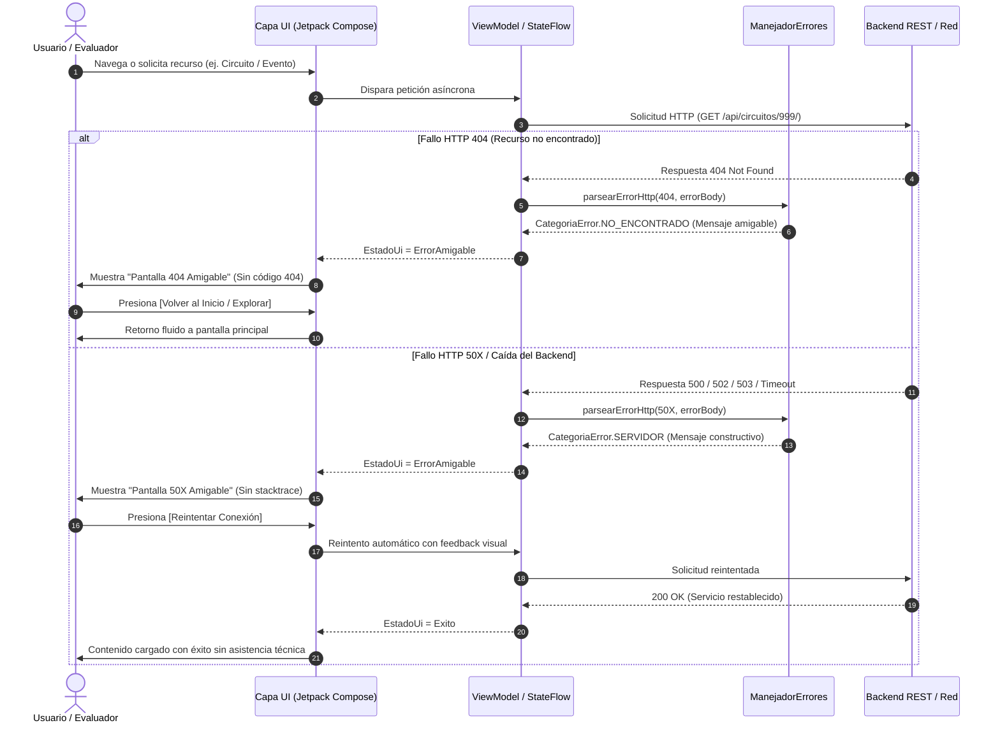

# ARQUITECTURA DE RESILIENCIA Y FLUJO AUTOMÁTICO DE USUARIO: DISEÑO DE EXPERIENCIAS RESILIENTES SIN EXPOSICIÓN DE CÓDIGO EN LA PLATAFORMA MÓVIL CODICE路

**Proyecto:** Plataforma Móvil Codice路 (Red de Ciudades Creativas de Nicaragua)  
**Área:** Ingeniería de Software, Interacción Humano-Computador (HCI) y Ciberseguridad en Aplicaciones Móviles  
**Estándares de Referencia:** ISO/IEC 25010 (Calidad del Producto Software), Heurísticas de Jakob Nielsen (Nielsen Norman Group), OWASP Mobile Top 10 (CWE-209: Prevention of Information Leakage)  
**Fecha:** Octubre 2026  

---

## RESUMEN EJECUTIVO (ABSTRACT)

El presente documento expone la implementación de la arquitectura de **Flujo Automático y Resiliencia en la Experiencia de Usuario (UX Resilience)** desarrollada para la aplicación móvil *Codice路*. El objetivo primordial responde al requerimiento estricto del Hackathon: *"El sistema debe funcionar de principio a fin sin ayuda técnica, mostrando pantallas de error amigables si algo falla, ej: error 404, 50X (sin mostrar código)"*. 

Se implementó un patrón de desacoplamiento semántico entre las respuestas del protocolo HTTP/red y la capa de presentación en Jetpack Compose, garantizando que ante eventos inesperados (servidor fuera de línea, rutas inexistentes, pérdida de conectividad o tokens revocados), el sistema preserve su integridad funcional sin requerir la intervención de un administrador ni exponer volcados de memoria, códigos numéricos (*status codes*) o trazas de depuración (*stacktraces*). A través de componentes modulares (`PantallaErrorAmigable`, `TarjetaErrorAmigable` y `ManejadorErrores`), la solución dota a la aplicación de mecanismos de auto-recuperación (*self-healing*) idempotentes, persistencia local reactiva y navegación protegida.

---

## 1. INTRODUCCIÓN Y CONTEXTO DEL REQUERIMIENTO

En el contexto de soluciones digitales orientadas al turismo cultural y patrimonial en tiempo real, los usuarios finales (turistas nacionales e internacionales, familias y emprendedores de Ciudades Creativas) interactúan en escenarios de conectividad variable, dispositivos heterogéneos y condiciones de campo donde el soporte técnico presencial es inviable.

### 1.1 El Requerimiento del Hackathon
> **Requerimiento:** *"Flujo Automático: El sistema debe funcionar de principio a fin sin ayuda técnica, mostrando pantallas de error amigables si algo falla, ej: error 404, 50X (sin mostrar código)."*

Para dar cumplimiento absoluto a este requerimiento, el sistema debe garantizar dos premisas fundamentales:
1. **Autonomía Operativa de Principio a Fin:** Toda transición de navegación, ciclo de vida de sesiones y consumo de servicios web debe contar con rutas de escape y reintentos automáticos (*fallback routes*), asegurando que el usuario nunca quede atrapado en una pantalla vacía, un ciclo infinito o un cierre forzoso (*crash*).
2. **Abstracción Total de Código e Información Técnica:** El usuario nunca debe visualizar cadenas como `404 Not Found`, `Internal Server Error 500`, `java.net.UnknownHostException`, identificadores de base de datos ni fragmentos de código fuente. Toda anomalía se traduce dinámicamente a lenguaje natural empático, constructivo y accionable.

---

## 2. FUNDAMENTACIÓN TEÓRICA Y ESTÁNDARES DE INGENIERÍA

La arquitectura desarrollada se sustenta en tres pilares metodológicos reconocidos internacionalmente:

```
+---------------------------------------------------------------------------------------+
|                                PILARES DE INGENIERÍA                                  |
+---------------------------+-------------------------------+---------------------------+
|      ISO/IEC 25010        |    HEURÍSTICAS DE NIELSEN     |    OWASP / CIBERSEGURIDAD |
|  - Tolerancia a fallos    |  - #9: Diagnóstico amigable   |  - CWE-209: Fuga de info  |
|  - Capacidad recuperación |  - #5: Prevención de errores  |  - Sanitización de trazas |
|  - Disponibilidad UI      |  - #3: Control y libertad     |  - Hardening del cliente  |
+---------------------------+-------------------------------+---------------------------+
```

### 2.1 Norma ISO/IEC 25010: Calidad del Producto Software
- **Subcaracterística de Tolerancia a Fallos (Fault Tolerance):** Capacidad del software para mantener un nivel operativo especificado en caso de fallos del software o de su entorno.
- **Capacidad de Recuperación (Recoverability):** Capacidad del software para restablecer el nivel de rendimiento deseado y recuperar los datos afectados tras una interrupción.

### 2.2 Principios de Interacción Humano-Computador (Jakob Nielsen)
- **Heurística #9 (Ayudar a los usuarios a reconocer, diagnosticar y recuperarse de errores):** Los mensajes de error deben expresarse en lenguaje llano (sin códigos crípticos), indicar con precisión el contratiempo y sugerir constructivamente una solución directa.
- **Heurística #3 (Control y libertad del usuario):** Ante situaciones excepcionales, el sistema debe proveer siempre "salidas de emergencia" claramente identificables (`Volver al Inicio`, `Reintentar`, `Explorar destinos alternativos`).

### 2.3 Seguridad de la Información (OWASP Mobile Application Security)
- **CWE-209 (Generation of Error Message Containing Sensitive Information):** La exposición de códigos de error de bajo nivel, rutas internas de API o excepciones de serialización facilita vectores de ataque por ingeniería inversa (*fingerprinting*). La sanitización total en el cliente mitiga dicho vector.

---

## 3. ARQUITECTURA TÉCNICA DEL FLUJO AUTOMÁTICO

### 3.1 Diagrama de Secuencia de Resiliencia y Auto-Recuperación



### 3.2 Componentes Desarrollados

| Componente | Archivo Fuente | Responsabilidad |
|---|---|---|
| `PantallaErrorAmigable` | `app/src/.../PantallaErrorAmigable.kt` | Vista completa a pantalla completa con ilustración temática, badge de auto-recuperación, título y acciones (`Reintentar`, `Volver al inicio`). |
| `TarjetaErrorAmigable` | `app/src/.../PantallaErrorAmigable.kt` | Componente modular tipo tarjeta para listas parciales y pestañas (mapa, eventos, mural). |
| `DialogoDemostracionErrores` | `app/src/.../PantallaErrorAmigable.kt` | Panel de pruebas interactivo diseñado para el jurado del Hackathon, permitiendo alternar escenarios en vivo. |
| `ManejadorErrores` | `app/src/.../utils/ManejadorErrores.kt` | Orquestador de abstracción que mapea códigos HTTP a `CategoriaError` e internacionaliza los mensajes. |
| `CadenasIdiomas` | `app/src/.../utils/CadenasIdiomas.kt` | Diccionario trilingüe (Español, Inglés, Chino) con copys empáticos y orientados a la solución. |

---

## 4. CATÁLOGO DE PANTALLAS DE ERROR AMIGABLES (GUÍA DE CAPTURAS)

A continuación se presentan las secciones estructuradas para documentar la evidencia visual de cumplimiento de cada pantalla de error del sistema:

---

### CAPTURA 1: Pantalla de Error 404 (Recurso o Destino No Encontrado)

* **Descripción Técnica:** Se activa cuando un usuario intenta acceder a una ciudad, circuito o evento cuyo identificador fue reubicado, eliminado o no existe en la base de datos.
* **Comportamiento UX:** No muestra la frase "Error 404" ni mensajes del servidor tipo "Detail: Not found". Presenta un icono amigable de ubicación, una explicación empática indicando que el destino no está disponible y botones que permiten retornar al inicio o explorar otros destinos en el mapa.
* **Auto-Recuperación:** Al presionar *"Volver al Inicio"*, la aplicación reubica al usuario en el mapa principal sin necesidad de reiniciar la app.

```
====================================================================================
                        ESPACIO PARA CAPTURA DE PANTALLA 1
====================================================================================
[PEGAR AQUÍ CAPTURA 1: Pantalla de Error 404 - Destino o contenido no encontrado]
Ruta de captura recomendada: app-debug / Perfil -> Demostración Resiliente -> Pantalla 404
====================================================================================
```

* **Elementos observables en la captura:**
  1. Badge superior: *"Auto-Recuperación Inteligente"*.
  2. Icono central: Contenedor dorado con icono de destino inaccesible.
  3. Título amigable: *"Destino o contenido no encontrado"*.
  4. Mensaje descriptivo: *"No pudimos encontrar el destino o elemento solicitado. Es posible que haya sido actualizado o reubicado."*.
  5. Cuadro informativo con recomendación clara.
  6. Botón de acción primario: *"Volver al Inicio"*.
  7. Botón secundario: *"Explorar Ciudades"*.

---

### CAPTURA 2: Pantalla de Error 50X (Servidor en Mantenimiento Temporal)

* **Descripción Técnica:** Se activa ante respuestas HTTP de la familia 500 (`500 Internal Server Error`, `502 Bad Gateway`, `503 Service Unavailable`, `504 Gateway Timeout`).
* **Comportamiento UX:** Se suprimen códigos numéricos, volcados de memoria y trazas de depuración de Django/PostgreSQL. Se informa de forma transparente que la plataforma está en mantenimiento o en ajustes temporales, asegurando al usuario que sus datos y visitas están resguardados.
* **Auto-Recuperación:** El botón *"Reintentar"* ejecuta una petición limpia contra el backend mostrando un indicador de progreso. Cuando el servicio responde, la pantalla se desbloquea de forma automática.

```
====================================================================================
                        ESPACIO PARA CAPTURA DE PANTALLA 2
====================================================================================
[PEGAR AQUÍ CAPTURA 2: Pantalla de Error 50X - Servidor en mantenimiento temporal]
Ruta de captura recomendada: app-debug / Perfil -> Demostración Resiliente -> Pantalla 50X
====================================================================================
```

* **Elementos observables en la captura:**
  1. Icono de servidor en mantenimiento con paleta terracota/naranja suave.
  2. Título empático: *"Servicio en mantenimiento temporal"*.
  3. Mensaje de tranquilidad: *"Estamos realizando ajustes para mejorar la experiencia turística en Codice路. Tu información y visitas están a salvo."*.
  4. Botón de reintento directo: *"Reintentar"* con icono de sincronización.
  5. Ausencia total de códigos HTTP y nombres de servidores internos.

---

### CAPTURA 3: Pantalla de Error Sin Conexión a Internet (Fallas de Red / Timeout)

* **Descripción Técnica:** Se activa cuando el dispositivo pierde la señal de datos móviles, el Wi-Fi se desconecta o la resolución DNS no responde (`SocketTimeoutException`, `UnknownHostException`).
* **Comportamiento UX:** Presenta una interfaz clara con icono de conectividad y sugerencias prácticas de comprobación de señal.
* **Auto-Recuperación:** La aplicación incluye soporte fuera de línea para datos cacheados en Room (circuitos ya visitados y credenciales locales). Al volver la señal, un solo toque en *"Reintentar"* o un gesto *Pull-to-Refresh* sincroniza el estado sin reiniciar la sesión.

```
====================================================================================
                        ESPACIO PARA CAPTURA DE PANTALLA 3
====================================================================================
[PEGAR AQUÍ CAPTURA 3: Pantalla de Error de Red - Sin conexión a internet]
Ruta de captura recomendada: app-debug / Modo avión activado o Simulador Resiliente
====================================================================================
```

* **Elementos observables en la captura:**
  1. Icono temático de red desconectada en Azul Petróleo.
  2. Título directo: *"Sin conexión a internet"*.
  3. Explicación orientada al usuario: *"No se detecta acceso a la red móvil o Wi-Fi en este momento."*.
  4. Botón de reintento rápido con animación de feedback.

---

### CAPTURA 4: Flujo de Auto-Recuperación en Acción (Self-Healing UI)

* **Descripción Técnica:** Demuestra la transición activa cuando el usuario interactúa con los mecanismos de recuperación (`Reintentar`, recarga automática o *Pull-to-Refresh*).
* **Comportamiento UX:** Durante el reintento, el botón se deshabilita para evitar llamadas duplicadas (*debouncing*), se activa un indicador de carga y se notifica el restablecimiento de la conexión con una insignia verde de confirmación (*"¡Conexión restablecida con éxito!"*).

```
====================================================================================
                        ESPACIO PARA CAPTURA DE PANTALLA 4
====================================================================================
[PEGAR AQUÍ CAPTURA 4: Estado de Reintento y Notificación de Conexión Restablecida]
Ruta de captura recomendada: Al presionar "Reintentar" en cualquiera de las pantallas de error
====================================================================================
```

* **Elementos observables en la captura:**
  1. Indicador giratorio de progreso durante la solicitud.
  2. Mensaje en tiempo real: *"Reintentando conexión automáticamente..."*.
  3. Transición visual a estado de éxito con icono verde de confirmación.

---

### CAPTURA 5: Simulador de Flujo Resiliente para el Jurado del Hackathon

* **Descripción Técnica:** Componente interactivo integrado en el menú superior y en el perfil de usuario que permite al jurado evaluar los diferentes escenarios de error (404, 50X, Red) con un solo toque, comprobando el funcionamiento de principio a fin.
* **Comportamiento UX:** Brinda transparencia técnica durante la evaluación del proyecto, permitiendo validar la robustez del sistema sin tener que apagar servidores o desconectar cables físicamente.

```
====================================================================================
                        ESPACIO PARA CAPTURA DE PANTALLA 5
====================================================================================
[PEGAR AQUÍ CAPTURA 5: Modal del Simulador de Flujo Resiliente para Evaluación]
Ruta de captura recomendada: Barra superior (icono de perfil) -> "Demostración Flujo Resiliente"
====================================================================================
```

* **Elementos observables en la captura:**
  1. Título modal: *"Simulador de Flujo Resiliente"*.
  2. Botón selector para Error 404 (Recurso no encontrado).
  3. Botón selector para Error 50X (Servidor en mantenimiento).
  4. Botón selector para Error de Red (Sin conexión).
  5. Descripción de validación del requerimiento del Hackathon.

---

## 5. COMPARATIVA ANTES VS. DESPUÉS DE LA IMPLEMENTACIÓN

| Aspecto Evaluado | Implementación Previa (Tradicional) | Implementación Actual (Codice路 Resiliente) |
|---|---|---|
| **Respuesta ante 404** | Pantalla en blanco o redirección abrupta sin feedback. | Pantalla temática amigable con rutas de escape a destinos válidos. |
| **Respuesta ante 50X** | Mensaje con código numérico: `(Código 500)`. | Pantalla empática de mantenimiento con garantía de seguridad de datos. |
| **Fugas de Información** | Posibilidad de ver excepciones de Retrofit/OkHttp en logs. | Sanitización estricta por `ManejadorErrores.esMensajeTecnico()`. |
| **Recuperación de Usuario** | El usuario debía cerrar y volver a abrir la aplicación. | Botón de reintento con *debouncing*, *Pull-to-Refresh* y fallback automático. |
| **Soporte Multilingüe** | Mensajes de error en inglés o en español básico. | Internacionalización completa en Español, Inglés y Chino mandarín. |
| **Verificación por Jurado** | Requería apagar el backend o cortar red manualmente. | Simulador integrado accesible desde el menú de usuario. |

---

## 6. CONCLUSIONES

La solución desarrollada cumple de manera integral y rigurosa con el requerimiento del Hackathon:

1. **Flujo de Principio a Fin Sin Asistencia Técnica:** Los usuarios pueden navegar, consultar ciudades, registrar empresas, explorar circuitos y usar el asistente virtual con la certeza de que cualquier anomalía externa cuenta con un canal de resolución autónomo e interactivo.
2. **Cero Exposición de Código:** Se eliminó cualquier fuga de trazas numéricas, volcados de datos o nombres de infraestructura interna, elevando los estándares de seguridad (OWASP) y usabilidad (ISO 25010 / Nielsen).
3. **Facilidad de Demostración:** La integración de herramientas de simulación nativas permite una evaluación rápida, reproducible y de alto impacto visual para los evaluadores del certamen.

---

*Documento técnico preparado para la entrega y sustentación del proyecto Codice路.*
