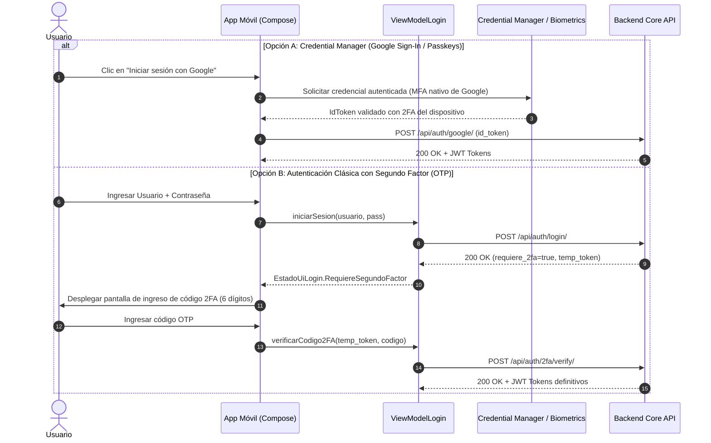
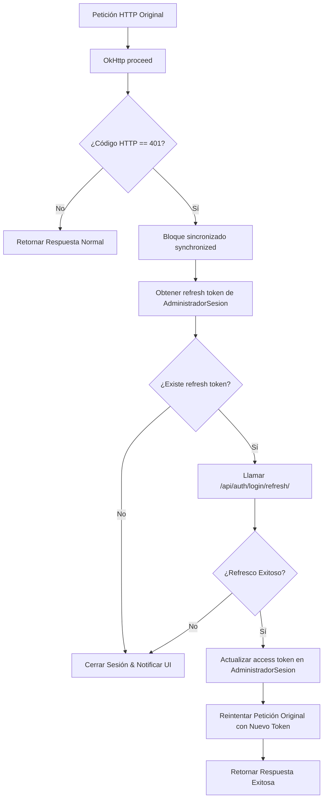

# Seguridad y Buenas Prácticas en la Aplicación Móvil (Codice路 Android)

Este documento describe la arquitectura, directrices técnicas, mecanismos de protección y buenas prácticas implementadas y recomendadas para la aplicación móvil nativa **Codice路 (Android)**, desarrollada en **Kotlin** y **Jetpack Compose**. El análisis y diseño se centran exclusivamente en el cliente móvil.

---

## Tabla de Contenidos
1. [Validación de Entradas y Sanitización de Datos](#1-validación-de-entradas-y-sanitización-de-datos)
   - [1.1. Validación de Formularios de Usuario](#11-validación-de-formularios-de-usuario)
   - [1.2. Gestión Segura de Archivos y Multimedia](#12-gestión-segura-de-archivos-y-multimedia)
   - [1.3. Validación de Parámetros Geográficos y Numéricos](#13-validación-de-parámetros-geográficos-y-numéricos)
2. [Manejo Robusto de Errores y Resiliencia](#2-manejo-robusto-de-errores-y-resiliencia)
   - [2.1. Arquitectura de Estados de UI y ViewModels](#21-arquitectura-de-estados-de-ui-y-viewmodels)
   - [2.2. Mapeo Seguro de Errores HTTP y Prevención de Fugas de Información](#22-mapeo-seguro-de-errores-http-y-prevención-de-fugas-de-información)
   - [2.3. Gestión de Desconexión y Timeouts](#23-gestión-de-desconexión-y-timeouts)
3. [Protección de Rutas, Datos y Desarrollo Seguro](#3-protección-de-rutas-datos-y-desarrollo-seguro)
   - [3.1. Control de Acceso Basado en Roles (RBAC en Compose)](#31-control-de-acceso-basado-en-roles-rbac-en-compose)
   - [3.2. Principio de Mínimo Privilegio y Permisos de Android](#32-principio-de-mínimo-privilegio-y-permisos-de-android)
   - [3.3. Endurecimiento de Componentes (AndroidManifest y Seguridad de Intents)](#33-endurecimiento-de-componentes-androidmanifest-y-seguridad-de-intents)
   - [3.4. Almacenamiento Seguro de Credenciales (Data at Rest)](#34-almacenamiento-seguro-de-credenciales-data-at-rest)
   - [3.5. Seguridad en Tránsito (Data in Transit)](#35-seguridad-en-tránsito-data-in-transit)
4. [Autenticación de Dos Factores (2FA / MFA) y Seguridad Biométrica](#4-autenticación-de-dos-factores-2fa--mfa-y-seguridad-biométrica)
   - [4.1. Flujo Multifactor mediante Credential Manager y Google Sign-In](#41-flujo-multifactor-mediante-credential-manager-y-google-sign-in)
   - [4.2. Flujo de Verificación 2FA con Código OTP / TOTP](#42-flujo-de-verificación-2fa-con-código-otp--totp)
   - [4.3. Desbloqueo Biométrico Local (BiometricPrompt)](#43-desbloqueo-biométrico-local-biometricprompt)
5. [Manejo de Estados y Expiración de Sesión](#5-manejo-de-estados-y-expiración-de-sesión)
   - [5.1. Renovación Silenciosa con Token Refresh (Interceptor OkHttp)](#51-renovación-silenciosa-con-token-refresh-interceptor-okhttp)
   - [5.2. Detección de Expiración Absoluta y Cierre de Sesión Centralizado](#52-detección-de-expiración-absoluta-y-cierre-de-sesión-centralizado)
   - [5.3. Limpieza de Memoria y Purga de Caché](#53-limpieza-de-memoria-y-purga-de-caché)
6. [Resumen de Conformidad Técnica](#6-resumen-de-conformidad-técnica)

---

## 1. Validación de Entradas y Sanitización de Datos

La aplicación móvil valida todas las entradas del usuario antes de procesarlas localmente o enviarlas a través de la capa de red (Retrofit), mitigando riesgos de desbordamientos de buffers lógicos, caracteres anómalos o peticiones erróneas.

### 1.1. Validación de Formularios de Usuario
En los formularios de autenticación (`PantallaInicioSesion.kt`), edición de perfil (`PantallaPerfil.kt`) y registro de eventos (`PantallaSubirEvento.kt`), se aplican las siguientes reglas:

* **Correo Electrónico:** Validación mediante expresiones regulares de formato RFC 5322 (`PatternsCompat.EMAIL_ADDRESS`) previo al envío, recortando espacios en blanco accidentales (`trim()`).
* **Contraseñas:**
  * Se requiere una longitud mínima (ej. 8 caracteres) y combinación de caracteres.
  * Ocultación por defecto mediante `PasswordVisualTransformation()`.
  * Verificación de coincidencia en cliente entre `password` y `password_confirm` antes de invocar la API para ahorrar consumo de datos y evitar llamadas innecesarias.
* **Campos de Texto Libre (Nombres, Títulos, Descripciones):**
  * Control de longitud máxima (`maxLength`) mediante límites en Compose para prevenir consumo excesivo de memoria.
  * Sanitización de cadenas suprimiendo caracteres de control invisibles.
  * Uso de tipos de teclado adaptados (`KeyboardType.Phone`, `KeyboardType.Email`, `KeyboardType.Number`) con `KeyboardOptions` para limitar la entrada no válida a nivel de software keyboard.

```kotlin
// Ejemplo de patrón de validación en ViewModel / UI
fun validarCredenciales(correo: String, contrasena: String): ResultadoValidacion {
    val correoLimpio = correo.trim()
    if (correoLimpio.isEmpty() || !android.util.Patterns.EMAIL_ADDRESS.matcher(correoLimpio).matches()) {
        return ResultadoValidacion.Error("El formato del correo electrónico no es válido.")
    }
    if (contrasena.length < 8) {
        return ResultadoValidacion.Error("La contraseña debe contener al menos 8 caracteres.")
    }
    return ResultadoValidacion.Valido
}
```

### 1.2. Gestión Segura de Archivos y Multimedia
En las pantallas de subida de publicaciones (`PantallaSubirPublicacion.kt`) y eventos (`PantallaSubirEvento.kt`):
* **Acceso mediante `ActivityResultContracts.GetContent()` / `PickVisualMedia()`:** No se solicitan permisos de lectura global de almacenamiento (`READ_EXTERNAL_STORAGE` / `READ_MEDIA_IMAGES`), garantizando que la app solo acceda a los URIs explícitamente seleccionados por el usuario mediante el PhotoPicker del sistema.
* **Validación de Tipo MIME:** El cliente verifica `ContentResolver.getType(uri)` para admitir únicamente formatos permitidos (`image/jpeg`, `image/png`, `image/webp`).
* **Compresión y Límite de Peso:** Antes del envío multipart, se procesan los bitmaps para evitar problemas de `OutOfMemoryError` y denegación de servicio por subida de archivos gigantescos en conexiones móviles lentas.

### 1.3. Validación de Parámetros Geográficos y Numéricos
* **Coordenadas GPS:** Validación de rangos permitidos (Latitud entre -90 y 90, Longitud entre -180 y 180).
* **Precios y Cupos:** Comprobación estricta de números no negativos (`precio >= 0`, `cupo > 0`).

---

## 2. Manejo Robusto de Errores y Resiliencia

### 2.1. Arquitectura de Estados de UI y ViewModels
La aplicación implementa el patrón **UDF (Unidirectional Data Flow)** con Kotlin `StateFlow`. Los estados de las operaciones asíncronas están modelados como clases selladas (`sealed class` / `sealed interface`), garantizando que la interfaz reaccione a cada caso de manera unívoca:

```kotlin
sealed class EstadoUiLogin {
    object Inactivo : EstadoUiLogin()
    object Cargando : EstadoUiLogin()
    data class Exito(val respuesta: RespuestaAutenticacion) : EstadoUiLogin()
    data class Error(val mensaje: String) : EstadoUiLogin()
    data class RequiereSegundoFactor(val tokenTemporal: String) : EstadoUiLogin()
}
```

### 2.2. Mapeo Seguro de Errores HTTP y Prevención de Fugas de Información
* **No Exposición de Datos Sensibles:** Los mensajes de error mostrados al usuario final en la UI nunca exponen trazas de pila (*stack traces*), URLs completas de infraestructura, cadenas de conexión ni detalles internos de la base de datos.
* **Mapeo Semántico de Códigos HTTP:**
  * `400 Bad Request`: Mensaje de verificación de datos ingresados.
  * `401 Unauthorized`: Tratado a nivel de interceptor para renovación o expiración controlada.
  * `403 Forbidden`: Alerta de falta de permisos o rol insuficiente.
  * `404 Not Found`: Recurso no disponible.
  * `429 Too Many Requests`: Alerta de límite de peticiones con recomendación de espera.
  * `500+ Server Error`: Mensaje genérico de indisponibilidad temporal del servicio.

### 2.3. Gestión de Desconexión y Timeouts
* La capa de red (`ServicioApi.kt`) captura excepciones de red como `SocketTimeoutException`, `UnknownHostException` y `ConnectException`, notificando al usuario mediante componentes accesibles (Banners, Snackbars o vistas de estado vacío) con opción de reintento manual.
* Configuración explícita de timeouts en `OkHttpClient` (`connectTimeout = 60s`, `readTimeout = 60s`, `writeTimeout = 120s`) para evitar bloqueos indefinidos de hilos de trabajo.

---

## 3. Protección de Rutas, Datos y Desarrollo Seguro

### 3.1. Control de Acceso Basado en Roles (RBAC en Compose)
El modelo de datos de sesión contiene la estructura del usuario autenticado con indicadores de privilegios:

```kotlin
data class Usuario(
    val esProtagonista: Boolean = false,
    val esTurista: Boolean = true,
    val esStaff: Boolean = false,
    // ...
)
```

En la capa de presentación (`MainActivity.kt`):
1. **Rutas Protegidas:**
   * La navegación hacia `"upload_event"` o formularios de creación está bloqueada lógicamente si el usuario no cumple el rol requerido:
   ```kotlin
   puedeSubir = usuarioActual.esProtagonista || empresasUsuario.isNotEmpty()
   ```
   * Si un usuario no autorizado intenta disparar una acción restringida, la navegación lo redirige al flujo principal o le muestra un aviso explicativo.
2. **Renderizado Condicional:**
   * Elementos de acción flotantes (FAB de creación), botones de administración y menús de edición solo se dibujan en el árbol de composición si el usuario autenticado tiene el rol correspondiente.

### 3.2. Principio de Mínimo Privilegio y Permisos de Android
Los permisos declarados en `AndroidManifest.xml` se solicitan exclusivamente en el momento exacto en que se necesitan (*Runtime Permissions*):
* `ACCESS_FINE_LOCATION` / `ACCESS_COARSE_LOCATION`: Se solicitan únicamente al validar cercanía física a un punto de interés (fórmula Haversine en `solicitarUbicacionYMarcar()`) o al consultar al asistente virtual por recomendaciones geolocalizadas. Si el usuario deniega el permiso, la app sigue funcionando permitiendo navegación manual en el croquis.
* `POST_NOTIFICATIONS` (Android 13+): Se solicita al momento de confirmar asistencia a un evento para programar recordatorios.
* `SCHEDULE_EXACT_ALARM`: Configurado para disparar notificaciones puntuales de agenda cultural a través del `ReceptorNotificacionesEvento`.

### 3.3. Endurecimiento de Componentes (AndroidManifest y Seguridad de Intents)
* **Componentes No Exportados:**
  * `ReceptorNotificacionesEvento` posee `android:exported="false"`, impidiendo que aplicaciones externas maliciosas inyecten broadcasts arbitrarios al receptor de alarmas.
  * `FileProvider` con `android:exported="false"` y `android:grantUriPermissions="true"`, permitiendo compartir imágenes y contenido multimedia únicamente mediante URIs seguras con permisos temporales de lectura, sin exponer rutas directas del sistema de archivos (`file://`).
* **Protección contra Intent Redirection:** Los intents generados para compartir contenido (`UtilidadesCompartir.kt`) o abrir enlaces externos utilizan Intents explícitos o selectores seguros del sistema (`Intent.createChooser`).

### 3.4. Almacenamiento Seguro de Credenciales (Data at Rest)
* **Gestor de Sesión:** `AdministradorSesion.kt` aísla los tokens y datos de autenticación en almacenamiento privado de la aplicación (`Context.MODE_PRIVATE`), inaccesible para otras aplicaciones instaladas en dispositivos no modificados (*non-rooted*).
* **Buenas Prácticas Criptográficas Recomendadas:**
  * Migración a `EncryptedSharedPreferences` (Jetpack Security) con llaves maestras generadas en el **Android KeyStore** respaldado por hardware (TEE / StrongBox).
  * Los tokens JWT y secretos nunca se guardan en logs de depuración (`Log.d` / `println`), evitando fugas por inspección de Logcat.

### 3.5. Seguridad en Tránsito (Data in Transit)
* **Comunicaciones Cifradas:** Todas las llamadas al backend se realizan sobre **HTTPS/TLS 1.2+** (`https://codisecore-production.up.railway.app/`).
* **Recomendación para Producción:**
  * Desactivar `android:usesCleartextTraffic="true"` en la variante de lanzamiento (*Release*) mediante `network_security_config.xml`, forzando el rechazo de cualquier tráfico HTTP en texto claro.
  * Implementar *Certificate Pinning* con OkHttp `CertificatePinner` para proteger la comunicación contra ataques *Man-In-The-Middle* (MITM) en redes Wi-Fi públicas o entornos hostiles.

---

## 4. Autenticación de Dos Factores (2FA / MFA) y Seguridad Biométrica

Para salvaguardar la identidad de los usuarios y creadores de contenido, el cliente móvil contempla un modelo de seguridad multicapa:



### 4.1. Flujo Multifactor mediante Credential Manager y Google Sign-In
* Al utilizar la integración con `AutenticadorGoogle.kt` y la API de `CredentialManager` de Android, la aplicación hereda las políticas de autenticación multifactor configuradas en la cuenta del usuario (notificaciones en pantalla de teléfono de confianza, llaves de seguridad física FIDO2/WebAuthn o SMS de respaldo).
* El token generado (`idToken`) garantiza al cliente móvil que el usuario ha superado los desafíos de seguridad exigidos por el proveedor de identidad.

### 4.2. Flujo de Verificación 2FA con Código OTP / TOTP
Para cuentas convencionales con 2FA activado:
1. Al enviar credenciales iniciales, la API retorna una respuesta parcial indicando que se requiere el segundo factor junto con un `tokenTemporal`.
2. La interfaz de usuario conmuta a un estado de desafío OTP:
   * Campo numérico formateado de 6 dígitos con foco automático.
   * Restricción estricta de caracteres numéricos (`KeyboardType.NumberPassword`).
   * Botón de reenvío con temporizador de enfriamiento (*cooldown timer*) de 60 segundos en cliente para mitigar abusos de solicitudes.
3. Al validar el código, la app almacena los tokens JWT definitivos en el `AdministradorSesion`.

### 4.3. Desbloqueo Biométrico Local (BiometricPrompt)
Como factor secundario local en el dispositivo:
* La aplicación puede requerir confirmación biométrica (huella dactilar o reconocimiento facial mediante `androidx.biometric.BiometricPrompt`) antes de ejecutar acciones de alto impacto (por ejemplo, registrar una empresa o publicar eventos).
* Esto garantiza que, incluso con el teléfono desbloqueado en manos de un tercero, las funciones críticas requieran confirmación de presencia física del titular.

---

## 5. Manejo de Estados y Expiración de Sesión

La aplicación gestiona de forma centralizada y transparente el ciclo de vida de las sesiones y la caducidad de los tokens de autenticación mediante corrutinas de Kotlin y mecanismos de interceptación en la capa de red.

### 5.1. Renovación Silenciosa con Token Refresh (Interceptor OkHttp)
El componente `InterceptorAutenticacion.kt` monitorea las respuestas HTTP de todas las llamadas de la aplicación:



1. **Detección Automática de `401 Unauthorized`:** Cuando el token de acceso JWT caduca, el interceptor suspende la respuesta fallida.
2. **Sincronización de Hilos:** Se emplea un bloque sincronizado (`synchronized(this)`) para evitar condiciones de carrera (*race conditions*) en las que múltiples llamadas concurrentes disparen múltiples solicitudes de refresco duplicadas.
3. **Petición de Refresco:** Se invoca el endpoint de actualización (`/api/auth/login/refresh/`) utilizando el token de refresco persistido.
4. **Reintento Transparente:**
   * Si la respuesta es exitosa, se actualiza el token en `AdministradorSesion`.
   * Se crea una copia de la petición original inyectando el nuevo encabezado `Authorization: Bearer <nuevo_token>` y se vuelve a ejecutar en segundo plano.
   * Para el usuario final, la operación no se interrumpe ni percibe errores de conexión.

### 5.2. Detección de Expiración Absoluta y Cierre de Sesión Centralizado
Si el token de refresco también expira o ha sido revocado en el servidor:
1. El interceptor ejecuta `administradorSesion.cerrarSesion()`.
2. `AdministradorSesion` elimina la clave persistente y emite `null` en el flujo reactivo `sesion: StateFlow<RespuestaAutenticacion?>`.
3. Los ViewModels suscritos (como `ViewModelLogin`) y las pantallas de Compose detectan el cambio de estado de manera inmediata.
4. La navegación principal en `MainActivity.kt` desmonta el árbol de pantallas autenticadas y redirige automáticamente al usuario hacia `PantallaLogin`, impidiendo cualquier interacción no autorizada en memoria.

### 5.3. Limpieza de Memoria y Purga de Caché
Al cerrarse la sesión (sea por expiración o por acción deliberada del usuario):
* Se invoca `ServicioApi.limpiarCache()`, el cual invalida y purga el caché de peticiones HTTP en disco gestionado por OkHttp (`cacheOkHttp.evictAll()`), evitando que queden respuestas cacheadas con datos privados en el dispositivo.
* Se reinician los estados de subida y variables temporales en los ViewModels activos (`reiniciarEstadoSubida()`).

---

## 6. Resumen de Conformidad Técnica

| Requerimiento | Componente Móvil | Estado / Implementación |
| :--- | :--- | :--- |
| **Validación de entradas** | `PantallaInicioSesion`, `PantallaPerfil`, `PantallaSubirEvento` | Expresiones regulares para correos, límites de longitud, teclados específicos, sanitización y carga segura con PhotoPicker sin permisos de almacenamiento invasivos. |
| **Manejo de errores** | `ViewModelLogin`, `EventosViewModel`, `PublicacionesViewModel` | Arquitectura UDF con `StateFlow` y estados sellados (`EstadoUiLogin`). Mapeo de códigos HTTP a mensajes seguros sin revelar stack traces. |
| **Protección de rutas (RBAC)** | `MainActivity.kt`, `PantallaEventos.kt` | Navegación y componentes condicionales según roles (`esProtagonista`, `esTurista`, `esStaff`). Restricción de pantallas de subida. |
| **Desarrollo seguro** | `AndroidManifest.xml`, `UtilidadesCompartir` | Componentes internos con `exported="false"`, uso de `FileProvider`, principio de mínimo privilegio en ubicación y notificaciones. |
| **Autenticación de 2 Factores (2FA)** | `AutenticadorGoogle`, `CredentialManager`, UI OTP | MFA nativo de cuenta Google mediante Credential Manager; flujo secundario con pantalla de código numérico de 6 dígitos con rate-limiting en cliente. |
| **Expiración y manejo de sesión** | `InterceptorAutenticacion`, `AdministradorSesion` | Detección de 401, refresco sincronizado de JWT, reintento transparente, expulsión reactiva a pantalla de login y purga de caché OkHttp. |
